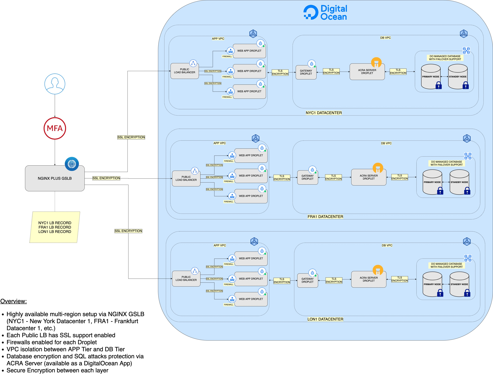

# Digital Ocean HIPAA Compliant Architecture

This is just a draft based on an initial research. The ideas and architecture diagrams presented here is just a POC (Proof Of Concept).

## Overview

First, some questions need to be asked first:

1. What makes a sistem `Highly Available` or `HA`? 
2. What makes a sistem `Secure` or less susceptible to malicious attacks (data steal/loss, ranswomware, etc) ?
3. Can `DigitalOcean` be a good candidate?

Before answering all of the above, some true facts need to be stated first:

1. `NO` system can be made `100%` HA because nothing is perfect (`DigitalOcean` guarantees `99% uptime` for all provided Cloud Services)
2. `NO` system can be `100%` secure due to many factors (software patches, using in 3rd party software or even unknown software sources sometimes, etc). What we can do is to try to make it less susceptible to attacks or harder to break. This is part of the `hardening` process of every sistem. Often this needs a `dedicated` person or team like `DevSecOps` and such.
3. As with every `Cloud Provider` available out there, some have advantages over the other in terms of the available `features`, `ease` of use, `support` and `maintenance`. And, let's not to forget about `costs` as well. `DigitalOcean` has attractive prices, a simpler `Cloud Services` architecture and interface and lots and lots of resources available in terms of `tutorials`, `how to's`, etc. In other words is more `Developer` oriented/friendly, and getting something to work is really fast and as painful as possible. This doesn't mean that it cannot scale up to meet higher demands for more `Enterprise` oriented applications and architectures. In the end, it all comes down to a tradeoff between `ease` of use and `low costs` vs `Enterprise` ready solutions (like `AWS`), which due to higher features available and `complexity` it can imply `more costs` and even `vendor lock-in` (`hard` to `migrate` the existing infrastructure to another `provider` in the future).

## HIPAA Architecture 1st Draft

In order for a system or architecture to be `HIPAA` compliant, there are many `"Terms and Conditions"` that it must obey or comply in terms of security, like:

1. How secure is the underlying infrastructure starting with all the machines being used and all the hardware the application runs on ? 
2. Is user data encrypted all over the place (starting from the log in process until it gets stored in a database somewhere) ? 
3. Is any sensitive part of the infrastructure exposed to the outside world ?
4. Is the system audited periodically? 
5. How does it handle software patching for security? Does it run vulnerability scans periodically?
6. Is the database less susceptible to injection attacks? Is the data stored encrypted and decryption keys safe?
7. Do we use extra safety for user logins, like MFA (Multi Factor Authentication) ?

The above list can go on and on. Let's have a first draft and then observe its strengths and weak points:

Nothing special here, just a plain old and classic architecture.

**Pros:**

1. `Highly available multi-region` setup via `DNS` Server (`DNS Server` is used as a `failover mechanism` between `Datacenters` from different `Regions`)
2. Each `Public Load Balancer` has `SSL` support enabled
3. `Firewalls` enabled and set up for each droplet
4. `VPC isolation` between the `Application` Tier and `Database` Tier
5. `Database encryption` and `SQL attacks` protection via `ACRA` Server (available as a `DigitalOcean App`)
6. `Secure Encryption` between each layer via `SSL/TLS`
7. `MFA` for Users

**Cons:**

1. `DigitalOcean` doesn't provide an `auto scaler` for their VM's (called `Droplets`). It's available if the `App Platform` is used, but it's kind of limited in functionality. For more details please visit the [App Platform Overview](https://docs.digitalocean.com/products/app-platform) and [App Platform Limitations](https://docs.digitalocean.com/products/app-platform/#limits).
2. Because of the above the architecture presented in the first draft is kind of `rigid` in terms of `resource usage` and `costs`. It means that no matter if the `load` on the system is `high` or `low`, a `fixed number` of VM's still `run in the background` and maybe doing almost `nothing`.
   
In terms of security and for the sake of simplicity a `VPN setup` was not added, but `OpenVPN` can be added and it's available as a `DigitalOcean App`. `DigitalOcean App` platform let's you easily install and configure `one-click apps` from a `trusted` marketplace. 

`Auditing` tools or `CVE` scanners for the `Droplets` (VM's that run `Linux` distros on `DigitalOcean Cloud`) were ommited for simplicity as well (this doesn't mean that options and support doesn't exist).

## HIPAA Architecture 2nd Draft

A more robust and efficient setup to use is one based on `Kubernetes`. This overcomes all of the above first draft cons, and even more.

`Kubernetes` is widely known for its `HA` features, `reliability`, `security` and `ease` of configuration. Not to mention the big `support` available from the `community` and ready to use `tools`.

To be continued ...